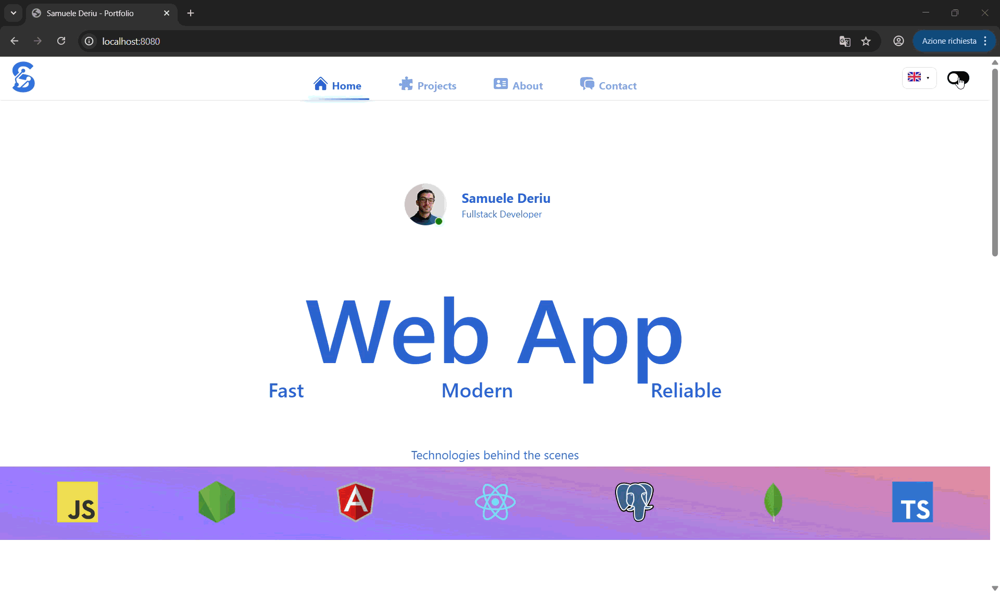
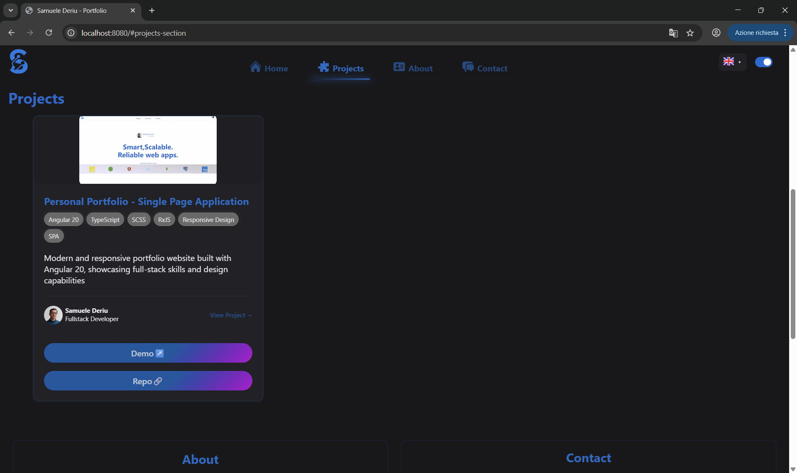
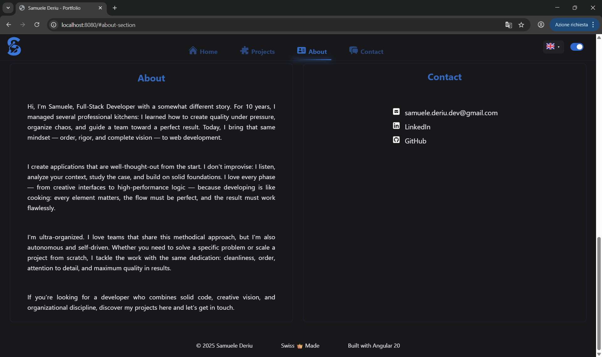
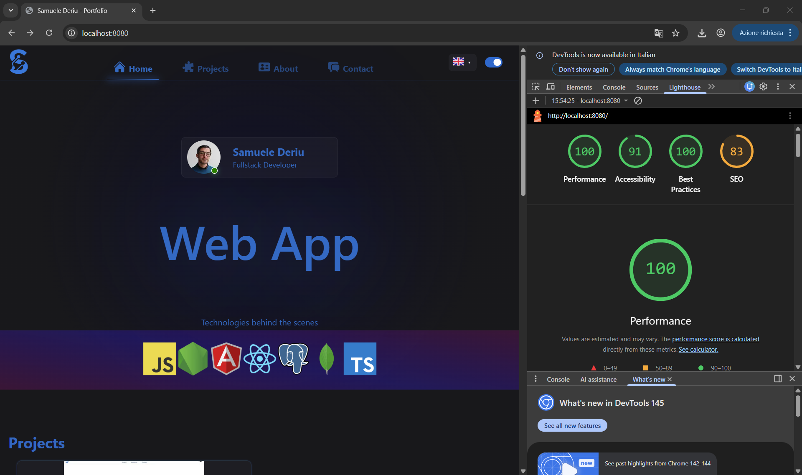

# Samuele Deriu - Personal Portfolio

A highly optimized Single Page Application (SPA) developed as a professional portfolio. Designed to overcome the performance limitations of standard templates, it serves as a reactive platform to document technical experience, ensuring instant loading times and a premium user experience across all devices.


> **[Live Demo](https://samexperience.github.io/Portfolio/)**

<p align="center">
  
</p>

## 📸 Overview

<p align="center">
  
</p>
<p align="center">
  
</p>
<p align="center">
  
</p>
## 🚀 Key Features

- **Blazing Fast Performance:** Extensive component and JS chunking for a lightweight main payload. Total elimination of First Contentful Paint delays.
- **Native Multi-language Support:** English, Italian, and French localized JSON data, managed via advanced RxJS patterns (switchMap, shareReplay) for instant client-side updates without redundant network calls.
- **Adaptive Theming:** Seamless Dark/Light mode toggle that respects OS-level preferences (`matchMedia`).
- **Automated Media Optimization:** Custom asynchronous Node.js pre-build engine (`gen-responsive-images.js`) using concurrency limits to generate responsive WebP assets in bulk.
- **SEO & Accessibility:** Strict semantic HTML structure to overcome classic SPA indexing limitations, complete with ARIA labels.

## 🏗️ Architecture

Built with **Angular 20** utilizing **Standalone Components** for high decoupling. The project leverages an end-to-end approach, demonstrating how design patterns (caching strategy, code splitting) transform a standard UI into an enterprise-grade, robust, and maintainable software entity.

### Directory Structure Highlights

```txt
src/app/
├── components/          # Standalone UI Elements (ThemeToggle, LanguageSelector)
├── services/            # RxJS Business Logic (DataService, ThemeService)
├── models/              # TypeScript interfaces defining the JSON payloads
└── styles/              # Global SCSS tokens and resets
```

## ⚡ Performance Verification

<p align="center">
  
</p>

## 💻 Development

### Prerequisites

- Node.js (v18+)
- npm

### Installation & Serving

```bash
# Install dependencies
npm install

# Start the development server
npm run start
```

Navigate to `http://localhost:4200/`. The application will automatically reload if you change any of the source files.

### Optimizing Images

To generate the responsive WebP images locally:

```bash
node dev-scripts/gen-responsive-images.js
```

### Build & Production Testing

```bash
# Build the project
npm run build

# Start the local Express SSR/Caching server to test the production build
node server.js
```

Navigate to `http://localhost:8080/` to test the production bundle with GZIP and cache headers.

## 📝 License

This project is for personal portfolio demonstration purposes. All rights reserved by Samuele Deriu.
